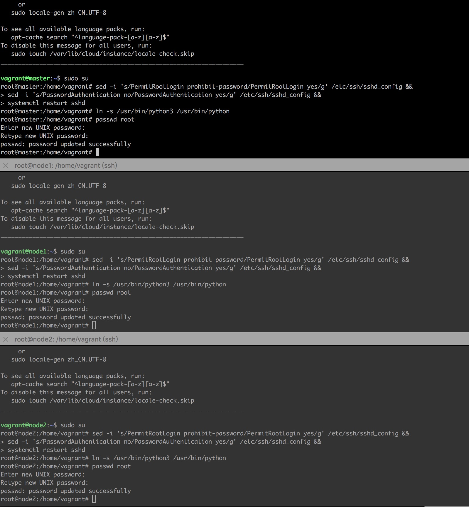
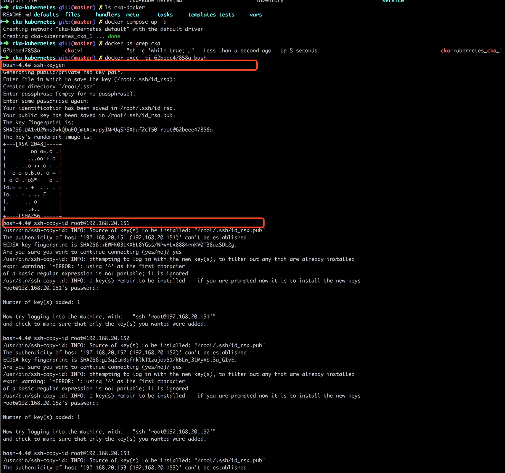
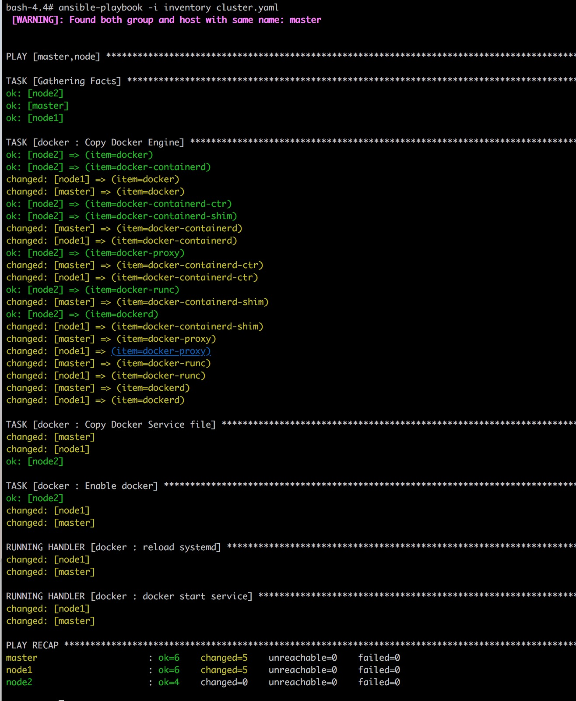
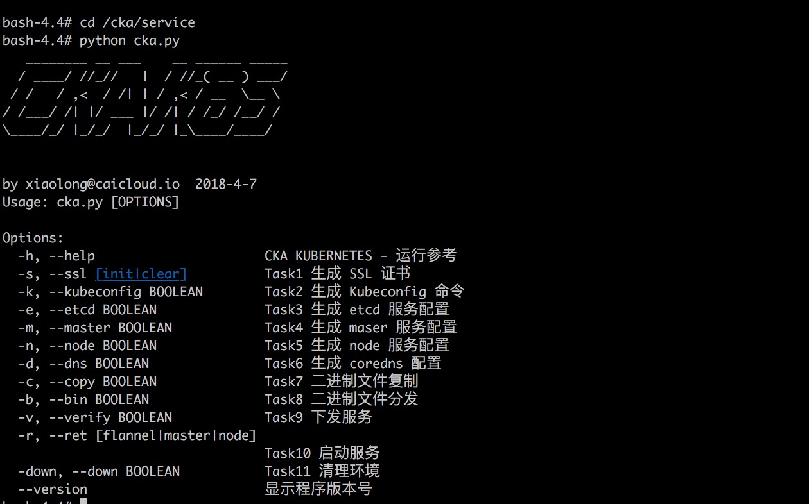
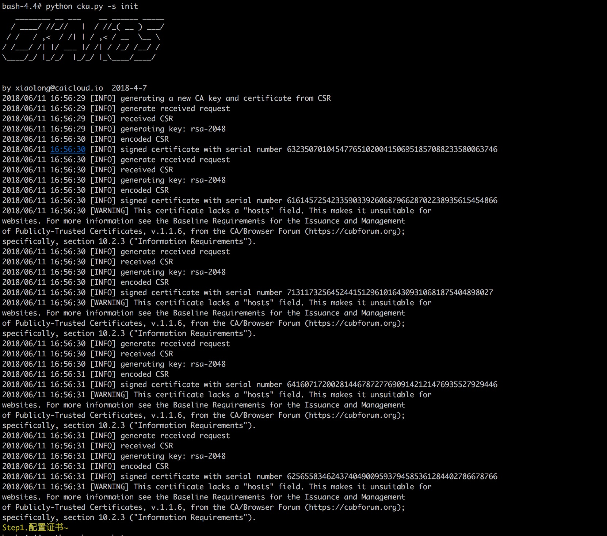
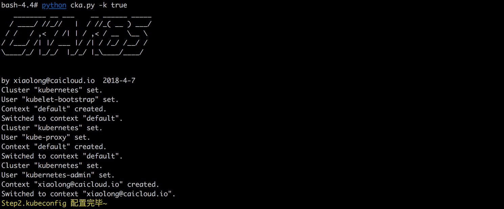

# 二进制安装 kubernetes

author: xiaolong@caicloud.io 

## 编译 cka 部署镜像

下载证书工具

```
mkdir -p cfssl && cd cfssl
wget https://pkg.cfssl.org/R1.2/cfssl_linux-amd64
chmod +x cfssl_linux-amd64

wget https://pkg.cfssl.org/R1.2/cfssljson_linux-amd64
chmod +x cfssljson_linux-amd64

wget https://pkg.cfssl.org/R1.2/cfssl-certinfo_linux-amd64
chmod +x cfssl-certinfo_linux-amd64
```

下载 kubectl 工具

https://github.com/kubernetes/kubernetes/blob/master/CHANGELOG-1.10.md#v1104

```
cd ..
curl -LO https://storage.googleapis.com/kubernetes-release/release/$(curl -s https://storage.googleapis.com/kubernetes-release/release/stable.txt)/bin/linux/amd64/kubectl
chmod +x ./kubectl

```

编译 cka:v1 镜像

```
docker build -t cka:v1 -f Docker/Dockerfile .
```

## Step1. 下载二进制安装部署包并解压至 down 目录

```
mkdir -p down/flannel && cd down 
wget https://dl.k8s.io/v1.10.0/kubernetes-server-linux-amd64.tar.gz 
wget https://github.com/coreos/etcd/releases/download/v3.2.18/etcd-v3.2.18-linux-amd64.tar.gz 
wget https://github.com/coreos/flannel/releases/download/v0.10.0/flannel-v0.10.0-linux-amd64.tar.gz 
tar -xf flannel-v0.10.0-linux-amd64.tar.gz -C flannel 
tar -xf etcd-v3.2.18-linux-amd64.tar.gz 
tar -xf kubernetes-server-linux-amd64-v1.10.0.tar.gz
cd ..
```

查看目录结构

```
➜  down tree -L 2
.
├── etcd-v3.2.18-linux-amd64
│   ├── Documentation
│   ├── README-etcdctl.md
│   ├── README.md
│   ├── READMEv2-etcdctl.md
│   ├── etcd
│   └── etcdctl
├── etcd-v3.2.18-linux-amd64.tar.gz
├── flannel
│   ├── README.md
│   ├── flanneld
│   └── mk-docker-opts.sh
├── flannel-v0.10.0-linux-amd64.tar.gz
├── kubernetes
│   ├── LICENSES
│   ├── addons
│   ├── kubernetes-src.tar.gz
│   └── server
└── kubernetes-server-linux-amd64-v1.10.0.tar.gz
```

## Step2. 准备虚拟机环境


```Vagrantfile
# -*- mode: ruby -*-
# # vi: set ft=ruby :
# Vagrantfile API/syntax version. Don't touch unless you know what you're doing!
VAGRANTFILE_API_VERSION = "2"

boxes = [
  {
    :name => "master",
    :eth1 => "192.168.20.151",
    :mem => "1024",
    :cpu => "2"
  },
  {
    :name => "node1",
    :eth1 => "192.168.20.152",
    :mem => "1024",
    :cpu => "2"
  },
  {
    :name => "node2",
    :eth1 => "192.168.20.153",
    :mem => "1024",
    :cpu => "2"
  }
]

Vagrant.configure(VAGRANTFILE_API_VERSION) do |config|
  config.vm.box = "ubuntu/xenial64"
  # Turn off shared folders
  config.vm.synced_folder ".", "/vagrant", id: "vagrant-root", disabled: true
  #config.vm.synced_folder "~/works/codelab/cka/files", "/files"
  # config.ssh.private_key_path = "~/.ssh/id_rsa"
  # config.ssh.forward_agent = true

  boxes.each do |opts|
    config.vm.define opts[:name] do |config|
      config.vm.hostname = opts[:name]
      config.ssh.insert_key = true
      # config.ssh.password = "vagrant"
      config.vm.provider "virtualbox" do |v|
        # v.gui = true
        v.customize ["modifyvm", :id, "--memory", opts[:mem]]
        v.customize ["modifyvm", :id, "--cpus", opts[:cpu]]
      end
      # config.vm.network :public_network
      config.vm.network "private_network", ip: opts[:eth1], auto_config: true
    end
  end
end

```

启动 vagrant 虚机

```
vagrant up

cka-kubernetes git:(master) ✗ vagrant status
Current machine states:

master                    running (virtualbox)
node1                     running (virtualbox)
node2                     running (virtualbox)

This environment represents multiple VMs. The VMs are all listed
above with their current state. For more information about a specific
VM, run `vagrant status NAME`.
```

## Step3. 配置虚机环境


下载二进制 docker 部署文件

```
git clone https://github.com/markthink/cka-docker.git
```


1. 祼 Docker 启动服务

```
docker run --add-host master:192.168.20.151 \
    --add-host node1:192.168.20.152 \
    --add-host node2:192.168.20.153 \
    -v `pwd`/down:/cka/down \
    -v `pwd`/cka-docker:/cka/docker \
    -ti cka:v1 sh
```

2. 使用 docker-compose 启动服务

cat docker-compose.yaml

```sh
version: '2'
services:
    cka: 
        image: cka:v1
        command: ["sh", "-c", "while true; do echo hello world; sleep 10; done"]
        volumes:
        - ./down:/cka/down
        - ./cka-docker:/cka/docker
        extra_hosts:
        - master:192.168.20.151
        - node1:192.168.20.152
        - node2:192.168.20.153    
```

解决虚拟机 root 用户密码方式登陆的问题-所有节点均需要配置

```
vagrant ssh master
~ sudo su
# passwd root

sed -i 's/PermitRootLogin prohibit-password/PermitRootLogin yes/g' /etc/ssh/sshd_config && 
sed -i 's/PasswordAuthentication no/PasswordAuthentication yes/g' /etc/ssh/sshd_config && 
systemctl restart sshd
ln -s /usr/bin/python3 /usr/bin/python
```



## Step4. 启动 cka:v1 容器开始部署

```
docker-compose up -d
```

进入 cka:v1 部署容器

```
ssh-keygen
ssh-copy-id master
ssh-copy-id node1
ssh-copy-id node2
```



安装 docker 

```
cd /cka/docker/tests
ansible-playbook -i inventory cluster.yaml
```



安装 kubernetes

```python
cd /cka/service 
python cka.py
# 生成证书
python cka.py -s init
# 生成 kubeconfig
python cka.py -k true
# 生成 etcd
python cka.py -e true
# 生成 master service
python cka.py -m true
# 生成 node service
python cka.py -n true
# 生成 yaml 服务配置-coredns
python cka.py -d true
# 拷贝二进制安装包
python cka.py -c true
# 下发二进制安装包
python cka.py -b true
# 下发服务+证书文件
python cka.py -v true
# 启动 master 服务
python cka.py -r flannel
# 启动 master 服务
python cka.py -r master

# 启动 node 服务
python cka.py -r node
```






对应的全日志

```
bash-4.4# python cka.py -s init
   ________ __ ___    __ ______ _____
  / ____/ //_//   |  / //_( __ ) ___/
 / /   / ,<  / /| | / ,< / __  \__ \
/ /___/ /| |/ ___ |/ /| / /_/ /__/ /
\____/_/ |_/_/  |_/_/ |_\____/____/


by xiaolong@caicloud.io  2018-4-7
2018/06/11 16:56:29 [INFO] generating a new CA key and certificate from CSR
2018/06/11 16:56:29 [INFO] generate received request
2018/06/11 16:56:29 [INFO] received CSR
2018/06/11 16:56:29 [INFO] generating key: rsa-2048
2018/06/11 16:56:30 [INFO] encoded CSR
2018/06/11 16:56:30 [INFO] signed certificate with serial number 632350701045477651020041506951857088233580063746
2018/06/11 16:56:30 [INFO] generate received request
2018/06/11 16:56:30 [INFO] received CSR
2018/06/11 16:56:30 [INFO] generating key: rsa-2048
2018/06/11 16:56:30 [INFO] encoded CSR
2018/06/11 16:56:30 [INFO] signed certificate with serial number 616145725423359033926068796628702238935615454866
2018/06/11 16:56:30 [WARNING] This certificate lacks a "hosts" field. This makes it unsuitable for
websites. For more information see the Baseline Requirements for the Issuance and Management
of Publicly-Trusted Certificates, v.1.1.6, from the CA/Browser Forum (https://cabforum.org);
specifically, section 10.2.3 ("Information Requirements").
2018/06/11 16:56:30 [INFO] generate received request
2018/06/11 16:56:30 [INFO] received CSR
2018/06/11 16:56:30 [INFO] generating key: rsa-2048
2018/06/11 16:56:30 [INFO] encoded CSR
2018/06/11 16:56:30 [INFO] signed certificate with serial number 71311732564524415129610164309310681875404898027
2018/06/11 16:56:30 [WARNING] This certificate lacks a "hosts" field. This makes it unsuitable for
websites. For more information see the Baseline Requirements for the Issuance and Management
of Publicly-Trusted Certificates, v.1.1.6, from the CA/Browser Forum (https://cabforum.org);
specifically, section 10.2.3 ("Information Requirements").
2018/06/11 16:56:30 [INFO] generate received request
2018/06/11 16:56:30 [INFO] received CSR
2018/06/11 16:56:30 [INFO] generating key: rsa-2048
2018/06/11 16:56:31 [INFO] encoded CSR
2018/06/11 16:56:31 [INFO] signed certificate with serial number 641607172002814467872776909142121476935527929446
2018/06/11 16:56:31 [WARNING] This certificate lacks a "hosts" field. This makes it unsuitable for
websites. For more information see the Baseline Requirements for the Issuance and Management
of Publicly-Trusted Certificates, v.1.1.6, from the CA/Browser Forum (https://cabforum.org);
specifically, section 10.2.3 ("Information Requirements").
2018/06/11 16:56:31 [INFO] generate received request
2018/06/11 16:56:31 [INFO] received CSR
2018/06/11 16:56:31 [INFO] generating key: rsa-2048
2018/06/11 16:56:31 [INFO] encoded CSR
2018/06/11 16:56:31 [INFO] signed certificate with serial number 625655834624374049009593794585361284402786678766
2018/06/11 16:56:31 [WARNING] This certificate lacks a "hosts" field. This makes it unsuitable for
websites. For more information see the Baseline Requirements for the Issuance and Management
of Publicly-Trusted Certificates, v.1.1.6, from the CA/Browser Forum (https://cabforum.org);
specifically, section 10.2.3 ("Information Requirements").
Step1.配置证书~
bash-4.4# python cka.py -k true
   ________ __ ___    __ ______ _____
  / ____/ //_//   |  / //_( __ ) ___/
 / /   / ,<  / /| | / ,< / __  \__ \
/ /___/ /| |/ ___ |/ /| / /_/ /__/ /
\____/_/ |_/_/  |_/_/ |_\____/____/


by xiaolong@caicloud.io  2018-4-7
Cluster "kubernetes" set.
User "kubelet-bootstrap" set.
Context "default" created.
Switched to context "default".
Cluster "kubernetes" set.
User "kube-proxy" set.
Context "default" created.
Switched to context "default".
Cluster "kubernetes" set.
User "kubernetes-admin" set.
Context "xiaolong@caicloud.io" created.
Switched to context "xiaolong@caicloud.io".
Step2.kubeconfig 配置完毕~
bash-4.4# python cka.py -e true
   ________ __ ___    __ ______ _____
  / ____/ //_//   |  / //_( __ ) ___/
 / /   / ,<  / /| | / ,< / __  \__ \
/ /___/ /| |/ ___ |/ /| / /_/ /__/ /
\____/_/ |_/_/  |_/_/ |_\____/____/


by xiaolong@caicloud.io  2018-4-7
Step3.ECTD 配置完毕~
bash-4.4# python cka.py -m true
   ________ __ ___    __ ______ _____
  / ____/ //_//   |  / //_( __ ) ___/
 / /   / ,<  / /| | / ,< / __  \__ \
/ /___/ /| |/ ___ |/ /| / /_/ /__/ /
\____/_/ |_/_/  |_/_/ |_\____/____/


by xiaolong@caicloud.io  2018-4-7
Step4.Master 配置完毕~
bash-4.4# python cka.py -n true
   ________ __ ___    __ ______ _____
  / ____/ //_//   |  / //_( __ ) ___/
 / /   / ,<  / /| | / ,< / __  \__ \
/ /___/ /| |/ ___ |/ /| / /_/ /__/ /
\____/_/ |_/_/  |_/_/ |_\____/____/


by xiaolong@caicloud.io  2018-4-7
Step5.Node 配置完毕~
bash-4.4# python cka.py -d true
   ________ __ ___    __ ______ _____
  / ____/ //_//   |  / //_( __ ) ___/
 / /   / ,<  / /| | / ,< / __  \__ \
/ /___/ /| |/ ___ |/ /| / /_/ /__/ /
\____/_/ |_/_/  |_/_/ |_\____/____/


by xiaolong@caicloud.io  2018-4-7
Step6. CoreDNS 配置完毕~
bash-4.4# python cka.py -c true
   ________ __ ___    __ ______ _____
  / ____/ //_//   |  / //_( __ ) ___/
 / /   / ,<  / /| | / ,< / __  \__ \
/ /___/ /| |/ ___ |/ /| / /_/ /__/ /
\____/_/ |_/_/  |_/_/ |_\____/____/


by xiaolong@caicloud.io  2018-4-7
Step7. 文件提取完毕~
bash-4.4# python cka.py -b true
   ________ __ ___    __ ______ _____
  / ____/ //_//   |  / //_( __ ) ___/
 / /   / ,<  / /| | / ,< / __  \__ \
/ /___/ /| |/ ___ |/ /| / /_/ /__/ /
\____/_/ |_/_/  |_/_/ |_\____/____/


by xiaolong@caicloud.io  2018-4-7
sending incremental file list
./
etcd
     17,837,888 100%   13.36MB/s    0:00:01 (xfr#1, to-chk=1/3)
etcdctl
     15,246,720 100%   10.50MB/s    0:00:01 (xfr#2, to-chk=0/3)

sent 10,219,396 bytes  received 57 bytes  2,919,843.71 bytes/sec
total size is 33,084,608  speedup is 3.24
sending incremental file list
./
etcd
     17,837,888 100%   12.89MB/s    0:00:01 (xfr#1, to-chk=1/3)
etcdctl
     15,246,720 100%   10.18MB/s    0:00:01 (xfr#2, to-chk=0/3)

sent 10,219,396 bytes  received 57 bytes  4,087,781.20 bytes/sec
total size is 33,084,608  speedup is 3.24
sending incremental file list
./
etcd
     17,837,888 100%   12.76MB/s    0:00:01 (xfr#1, to-chk=1/3)
etcdctl
     15,246,720 100%    8.73MB/s    0:00:01 (xfr#2, to-chk=0/3)

sent 10,219,396 bytes  received 57 bytes  2,919,843.71 bytes/sec
total size is 33,084,608  speedup is 3.24
sending incremental file list
./
kube-apiserver
    223,849,377 100%   23.29MB/s    0:00:09 (xfr#1, to-chk=3/5)
kube-controller-manager
    146,666,058 100%   18.07MB/s    0:00:07 (xfr#2, to-chk=2/5)
kube-scheduler
     49,246,556 100%   13.32MB/s    0:00:03 (xfr#3, to-chk=1/5)
kubectl
     54,277,699 100%   14.63MB/s    0:00:03 (xfr#4, to-chk=0/5)

sent 86,226,537 bytes  received 95 bytes  3,669,218.38 bytes/sec
total size is 474,039,690  speedup is 5.50
sending incremental file list
./
flanneld
     36,327,752 100%   14.86MB/s    0:00:02 (xfr#1, to-chk=3/5)
kube-proxy
     51,326,468 100%   14.41MB/s    0:00:03 (xfr#2, to-chk=2/5)
kubelet
    152,761,952 100%   13.97MB/s    0:00:10 (xfr#3, to-chk=1/5)
mk-docker-opts.sh
          2,139 100%    4.90kB/s    0:00:00 (xfr#4, to-chk=0/5)

sent 53,227,799 bytes  received 95 bytes  3,225,932.97 bytes/sec
total size is 240,418,311  speedup is 4.52
sending incremental file list
./
flanneld
     36,327,752 100%   15.34MB/s    0:00:02 (xfr#1, to-chk=3/5)
kube-proxy
     51,326,468 100%   14.89MB/s    0:00:03 (xfr#2, to-chk=2/5)
kubelet
    152,761,952 100%   19.27MB/s    0:00:07 (xfr#3, to-chk=1/5)
mk-docker-opts.sh
          2,139 100%    3.70kB/s    0:00:00 (xfr#4, to-chk=0/5)

sent 53,227,799 bytes  received 95 bytes  3,942,806.96 bytes/sec
total size is 240,418,311  speedup is 4.52
sending incremental file list
./
flanneld
     36,327,752 100%   15.75MB/s    0:00:02 (xfr#1, to-chk=3/5)
kube-proxy
     51,326,468 100%   13.12MB/s    0:00:03 (xfr#2, to-chk=2/5)
kubelet
    152,761,952 100%   18.33MB/s    0:00:07 (xfr#3, to-chk=1/5)
mk-docker-opts.sh
          2,139 100%    2.20kB/s    0:00:00 (xfr#4, to-chk=0/5)

sent 53,227,799 bytes  received 95 bytes  3,942,806.96 bytes/sec
total size is 240,418,311  speedup is 4.52
Step8. 文件部署完毕~
bash-4.4# python cka.py -v true
   ________ __ ___    __ ______ _____
  / ____/ //_//   |  / //_( __ ) ___/
 / /   / ,<  / /| | / ,< / __  \__ \
/ /___/ /| |/ ___ |/ /| / /_/ /__/ /
\____/_/ |_/_/  |_/_/ |_\____/____/


by xiaolong@caicloud.io  2018-4-7
sending incremental file list
etcd.service
            823 100%    0.00kB/s    0:00:00 (xfr#1, to-chk=0/1)

sent 457 bytes  received 35 bytes  984.00 bytes/sec
total size is 823  speedup is 1.67
sending incremental file list
./
admin-csr.json
            262 100%    0.00kB/s    0:00:00 (xfr#1, to-chk=25/27)
admin-key.pem
          1,679 100%    1.60MB/s    0:00:00 (xfr#2, to-chk=24/27)
admin.csr
          1,013 100%  989.26kB/s    0:00:00 (xfr#3, to-chk=23/27)
admin.pem
          1,407 100%    1.34MB/s    0:00:00 (xfr#4, to-chk=22/27)
basic_auth_file
             30 100%    9.77kB/s    0:00:00 (xfr#5, to-chk=21/27)
bootstrap.kubeconfig
          2,176 100%  708.33kB/s    0:00:00 (xfr#6, to-chk=20/27)
ca-key.pem
          1,679 100%  409.91kB/s    0:00:00 (xfr#7, to-chk=19/27)
ca.csr
          1,005 100%  196.29kB/s    0:00:00 (xfr#8, to-chk=18/27)
ca.pem
          1,363 100%  266.21kB/s    0:00:00 (xfr#9, to-chk=17/27)
config.json
            325 100%   63.48kB/s    0:00:00 (xfr#10, to-chk=16/27)
csr.json
            239 100%   46.68kB/s    0:00:00 (xfr#11, to-chk=15/27)
flanneld-csr.json
            254 100%   41.34kB/s    0:00:00 (xfr#12, to-chk=14/27)
flanneld-key.pem
          1,679 100%  234.24kB/s    0:00:00 (xfr#13, to-chk=13/27)
flanneld.csr
          1,001 100%  122.19kB/s    0:00:00 (xfr#14, to-chk=12/27)
flanneld.pem
          1,395 100%  151.37kB/s    0:00:00 (xfr#15, to-chk=11/27)
kube-proxy-csr.json
            263 100%   25.68kB/s    0:00:00 (xfr#16, to-chk=10/27)
kube-proxy-key.pem
          1,675 100%  163.57kB/s    0:00:00 (xfr#17, to-chk=9/27)
kube-proxy.csr
          1,013 100%   89.93kB/s    0:00:00 (xfr#18, to-chk=8/27)
kube-proxy.kubeconfig
          6,282 100%  511.23kB/s    0:00:00 (xfr#19, to-chk=7/27)
kube-proxy.pem
          1,407 100%  114.50kB/s    0:00:00 (xfr#20, to-chk=6/27)
kubeconfig
          6,324 100%  475.06kB/s    0:00:00 (xfr#21, to-chk=5/27)
kubernetes-csr.json
            531 100%   37.04kB/s    0:00:00 (xfr#22, to-chk=4/27)
kubernetes-key.pem
          1,679 100%  109.31kB/s    0:00:00 (xfr#23, to-chk=3/27)
kubernetes.csr
          1,245 100%   75.99kB/s    0:00:00 (xfr#24, to-chk=2/27)
kubernetes.pem
          1,619 100%   93.00kB/s    0:00:00 (xfr#25, to-chk=1/27)
token.csv
             83 100%    4.50kB/s    0:00:00 (xfr#26, to-chk=0/27)

sent 28,163 bytes  received 513 bytes  57,352.00 bytes/sec
total size is 37,628  speedup is 1.31
sending incremental file list
./
admin-csr.json
            262 100%    0.00kB/s    0:00:00 (xfr#1, to-chk=25/27)
admin-key.pem
          1,679 100%    1.60MB/s    0:00:00 (xfr#2, to-chk=24/27)
admin.csr
          1,013 100%  989.26kB/s    0:00:00 (xfr#3, to-chk=23/27)
admin.pem
          1,407 100%  687.01kB/s    0:00:00 (xfr#4, to-chk=22/27)
basic_auth_file
             30 100%   14.65kB/s    0:00:00 (xfr#5, to-chk=21/27)
bootstrap.kubeconfig
          2,176 100%  531.25kB/s    0:00:00 (xfr#6, to-chk=20/27)
ca-key.pem
          1,679 100%  409.91kB/s    0:00:00 (xfr#7, to-chk=19/27)
ca.csr
          1,005 100%  196.29kB/s    0:00:00 (xfr#8, to-chk=18/27)
ca.pem
          1,363 100%  221.84kB/s    0:00:00 (xfr#9, to-chk=17/27)
config.json
            325 100%   45.34kB/s    0:00:00 (xfr#10, to-chk=16/27)
csr.json
            239 100%   33.34kB/s    0:00:00 (xfr#11, to-chk=15/27)
flanneld-csr.json
            254 100%   31.01kB/s    0:00:00 (xfr#12, to-chk=14/27)
flanneld-key.pem
          1,679 100%  182.18kB/s    0:00:00 (xfr#13, to-chk=13/27)
flanneld.csr
          1,001 100%   97.75kB/s    0:00:00 (xfr#14, to-chk=12/27)
flanneld.pem
          1,395 100%  136.23kB/s    0:00:00 (xfr#15, to-chk=11/27)
kube-proxy-csr.json
            263 100%   25.68kB/s    0:00:00 (xfr#16, to-chk=10/27)
kube-proxy-key.pem
          1,675 100%  148.70kB/s    0:00:00 (xfr#17, to-chk=9/27)
kube-proxy.csr
          1,013 100%   82.44kB/s    0:00:00 (xfr#18, to-chk=8/27)
kube-proxy.kubeconfig
          6,282 100%  471.91kB/s    0:00:00 (xfr#19, to-chk=7/27)
kube-proxy.pem
          1,407 100%   98.14kB/s    0:00:00 (xfr#20, to-chk=6/27)
kubeconfig
          6,324 100%  441.13kB/s    0:00:00 (xfr#21, to-chk=5/27)
kubernetes-csr.json
            531 100%   34.57kB/s    0:00:00 (xfr#22, to-chk=4/27)
kubernetes-key.pem
          1,679 100%  102.48kB/s    0:00:00 (xfr#23, to-chk=3/27)
kubernetes.csr
          1,245 100%   71.52kB/s    0:00:00 (xfr#24, to-chk=2/27)
kubernetes.pem
          1,619 100%   87.84kB/s    0:00:00 (xfr#25, to-chk=1/27)
token.csv
             83 100%    4.50kB/s    0:00:00 (xfr#26, to-chk=0/27)

sent 28,163 bytes  received 513 bytes  19,117.33 bytes/sec
total size is 37,628  speedup is 1.31
sending incremental file list
./
admin-csr.json
            262 100%    0.00kB/s    0:00:00 (xfr#1, to-chk=25/27)
admin-key.pem
          1,679 100%    1.60MB/s    0:00:00 (xfr#2, to-chk=24/27)
admin.csr
          1,013 100%  989.26kB/s    0:00:00 (xfr#3, to-chk=23/27)
admin.pem
          1,407 100%    1.34MB/s    0:00:00 (xfr#4, to-chk=22/27)
basic_auth_file
             30 100%   29.30kB/s    0:00:00 (xfr#5, to-chk=21/27)
bootstrap.kubeconfig
          2,176 100%    2.08MB/s    0:00:00 (xfr#6, to-chk=20/27)
ca-key.pem
          1,679 100%    1.60MB/s    0:00:00 (xfr#7, to-chk=19/27)
ca.csr
          1,005 100%  981.45kB/s    0:00:00 (xfr#8, to-chk=18/27)
ca.pem
          1,363 100%    1.30MB/s    0:00:00 (xfr#9, to-chk=17/27)
config.json
            325 100%  317.38kB/s    0:00:00 (xfr#10, to-chk=16/27)
csr.json
            239 100%  233.40kB/s    0:00:00 (xfr#11, to-chk=15/27)
flanneld-csr.json
            254 100%  248.05kB/s    0:00:00 (xfr#12, to-chk=14/27)
flanneld-key.pem
          1,679 100%  819.82kB/s    0:00:00 (xfr#13, to-chk=13/27)
flanneld.csr
          1,001 100%  488.77kB/s    0:00:00 (xfr#14, to-chk=12/27)
flanneld.pem
          1,395 100%  681.15kB/s    0:00:00 (xfr#15, to-chk=11/27)
kube-proxy-csr.json
            263 100%  128.42kB/s    0:00:00 (xfr#16, to-chk=10/27)
kube-proxy-key.pem
          1,675 100%  817.87kB/s    0:00:00 (xfr#17, to-chk=9/27)
kube-proxy.csr
          1,013 100%  494.63kB/s    0:00:00 (xfr#18, to-chk=8/27)
kube-proxy.kubeconfig
          6,282 100%    3.00MB/s    0:00:00 (xfr#19, to-chk=7/27)
kube-proxy.pem
          1,407 100%  458.01kB/s    0:00:00 (xfr#20, to-chk=6/27)
kubeconfig
          6,324 100%    2.01MB/s    0:00:00 (xfr#21, to-chk=5/27)
kubernetes-csr.json
            531 100%  172.85kB/s    0:00:00 (xfr#22, to-chk=4/27)
kubernetes-key.pem
          1,679 100%  546.55kB/s    0:00:00 (xfr#23, to-chk=3/27)
kubernetes.csr
          1,245 100%  405.27kB/s    0:00:00 (xfr#24, to-chk=2/27)
kubernetes.pem
          1,619 100%  527.02kB/s    0:00:00 (xfr#25, to-chk=1/27)
token.csv
             83 100%   27.02kB/s    0:00:00 (xfr#26, to-chk=0/27)

sent 28,163 bytes  received 513 bytes  57,352.00 bytes/sec
total size is 37,628  speedup is 1.31
sending incremental file list
./
flanneld.service
            727 100%    0.00kB/s    0:00:00 (xfr#1, to-chk=2/4)
kube-proxy.service
            499 100%  487.30kB/s    0:00:00 (xfr#2, to-chk=1/4)
kubelet.service
            768 100%  750.00kB/s    0:00:00 (xfr#3, to-chk=0/4)

sent 1,435 bytes  received 76 bytes  1,007.33 bytes/sec
total size is 1,994  speedup is 1.32
sending incremental file list
./
flanneld.service
            727 100%    0.00kB/s    0:00:00 (xfr#1, to-chk=2/4)
kube-proxy.service
            498 100%  486.33kB/s    0:00:00 (xfr#2, to-chk=1/4)
kubelet.service
            767 100%  749.02kB/s    0:00:00 (xfr#3, to-chk=0/4)

sent 1,434 bytes  received 76 bytes  3,020.00 bytes/sec
total size is 1,992  speedup is 1.32
sending incremental file list
./
flanneld.service
            727 100%    0.00kB/s    0:00:00 (xfr#1, to-chk=2/4)
kube-proxy.service
            498 100%  486.33kB/s    0:00:00 (xfr#2, to-chk=1/4)
kubelet.service
            767 100%  749.02kB/s    0:00:00 (xfr#3, to-chk=0/4)

sent 1,435 bytes  received 76 bytes  3,022.00 bytes/sec
total size is 1,992  speedup is 1.32
sending incremental file list
./
kube-apiserver.service
          1,512 100%    0.00kB/s    0:00:00 (xfr#1, to-chk=2/4)
kube-controller-manager.service
            739 100%  721.68kB/s    0:00:00 (xfr#2, to-chk=1/4)
kube-scheduler.service
            361 100%  352.54kB/s    0:00:00 (xfr#3, to-chk=0/4)

sent 1,550 bytes  received 76 bytes  3,252.00 bytes/sec
total size is 2,612  speedup is 1.61

systemctl daemon-reload && systemctl start etcd && systemctl enable etcd

Master Run:
ETCDCTL_API=3 etcdctl --endpoints=https://192.168.20.151:2379 --cacert=/etc/kubernetes/ssl/ca.pem --cert=/etc/kubernetes/ssl/kubernetes.pem --key=/etc/kubernetes/ssl/kubernetes-key.pem endpoint health;
etcdctl --endpoints=https://192.168.20.151:2379 --ca-file=/etc/kubernetes/ssl/ca.pem  --cert-file=/etc/kubernetes/ssl/kubernetes.pem --key-file=/etc/kubernetes/ssl/kubernetes-key.pem get /kubernetes/network/config

etcdctl --endpoints=https://192.168.20.151:2379 \
--ca-file=/etc/kubernetes/ssl/ca.pem \
--cert-file=/etc/kubernetes/ssl/kubernetes.pem \
--key-file=/etc/kubernetes/ssl/kubernetes-key.pem \
set /kubernetes/network/config '{"Network": "172.30.0.0/16", "SubnetLen": 24, "Backend": {"Type": "vxlan"}}'
Step9. 服务下发~
bash-4.4# python cka.py -r flannel
   ________ __ ___    __ ______ _____
  / ____/ //_//   |  / //_( __ ) ___/
 / /   / ,<  / /| | / ,< / __  \__ \
/ /___/ /| |/ ___ |/ /| / /_/ /__/ /
\____/_/ |_/_/  |_/_/ |_\____/____/


by xiaolong@caicloud.io  2018-4-7
Created symlink from /etc/systemd/system/multi-user.target.wants/flanneld.service to /etc/systemd/system/flanneld.service.
Created symlink from /etc/systemd/system/docker.service.requires/flanneld.service to /etc/systemd/system/flanneld.service.
Created symlink from /etc/systemd/system/multi-user.target.wants/flanneld.service to /etc/systemd/system/flanneld.service.
Created symlink from /etc/systemd/system/docker.service.requires/flanneld.service to /etc/systemd/system/flanneld.service.
Created symlink from /etc/systemd/system/multi-user.target.wants/flanneld.service to /etc/systemd/system/flanneld.service.
Created symlink from /etc/systemd/system/docker.service.requires/flanneld.service to /etc/systemd/system/flanneld.service.
Step10. 启动 flanneld 服务~
bash-4.4# python cka.py -r master
   ________ __ ___    __ ______ _____
  / ____/ //_//   |  / //_( __ ) ___/
 / /   / ,<  / /| | / ,< / __  \__ \
/ /___/ /| |/ ___ |/ /| / /_/ /__/ /
\____/_/ |_/_/  |_/_/ |_\____/____/


by xiaolong@caicloud.io  2018-4-7

echo -e "192.168.20.151 kube-master
192.168.20.152 kube-node1
192.168.20.153 kube-node2" >> /etc/hosts
kubectl create clusterrolebinding kubelet-bootstrap --clusterrole=system:node-bootstrapper  --user=kubelet-bootstrap

Created symlink from /etc/systemd/system/multi-user.target.wants/kube-apiserver.service to /etc/systemd/system/kube-apiserver.service.
Created symlink from /etc/systemd/system/multi-user.target.wants/kube-controller-manager.service to /etc/systemd/system/kube-controller-manager.service.
Created symlink from /etc/systemd/system/multi-user.target.wants/kube-scheduler.service to /etc/systemd/system/kube-scheduler.service.
Step10. 启动 master 服务~
bash-4.4# python cka.py -r node
   ________ __ ___    __ ______ _____
  / ____/ //_//   |  / //_( __ ) ___/
 / /   / ,<  / /| | / ,< / __  \__ \
/ /___/ /| |/ ___ |/ /| / /_/ /__/ /
\____/_/ |_/_/  |_/_/ |_\____/____/


by xiaolong@caicloud.io  2018-4-7

kubectl get csr | awk '/Pending/ {print $1}' | xargs kubectl certificate approve

Created symlink from /etc/systemd/system/multi-user.target.wants/kubelet.service to /etc/systemd/system/kubelet.service.
Created symlink from /etc/systemd/system/multi-user.target.wants/kube-proxy.service to /etc/systemd/system/kube-proxy.service.
Created symlink from /etc/systemd/system/multi-user.target.wants/kubelet.service to /etc/systemd/system/kubelet.service.
Created symlink from /etc/systemd/system/multi-user.target.wants/kube-proxy.service to /etc/systemd/system/kube-proxy.service.
Created symlink from /etc/systemd/system/multi-user.target.wants/kubelet.service to /etc/systemd/system/kubelet.service.
Created symlink from /etc/systemd/system/multi-user.target.wants/kube-proxy.service to /etc/systemd/system/kube-proxy.service.
Step10. 启动 node 服务~
```

### 部署 DNS 服务


```
bash-4.4# scp -r gen/yaml root@master:/root
```

切换 master 执行

```
kubectl create -f /root/yaml/coredns.yaml
kubectl create -f /root/yaml/dashboard.yaml
```


## Enjoy Youself!
